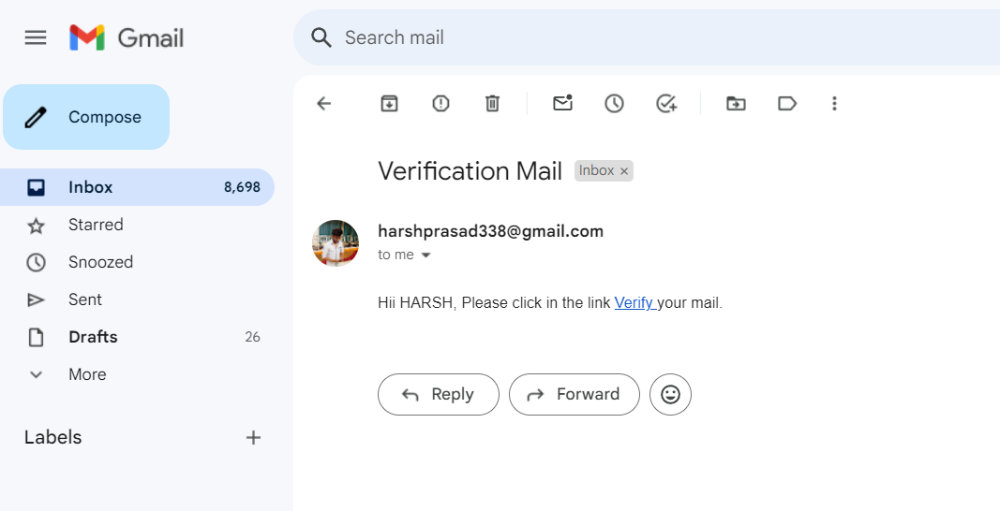

Steps to run the program:

1. Clone or copy all the files
2. cd into PropertyLords
3. run `npm install` in the terminal
4. `cd src`
5. `nodemon app.js`

This projects completes all the requirement as asked, though the UI is not very beautiful.

Requirements Completed : 

1. Seller can add / edit their product. Seller can also delete their product.
2. A seamless sing-up and log-in flow for both user and seller.
3. Email verification at the time of sign-up [Email verification will not work as I have removed smtp password due to security reasons, will provide screenshot]
4. Filter searches , you can do it in navbar.
5. ALl the necessary attribute for listing home.

Email screenshots
